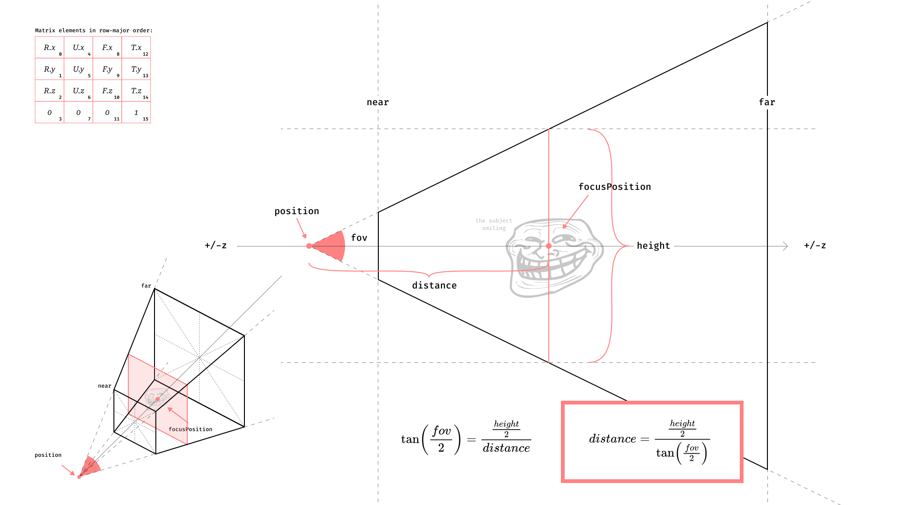

# Vertigo Camera

Vertigo is a new camera model where the attention is focused on the subject (the 
model) and no longer the object (the eye).

In other words, exit the eye out, welcome the model.

Key concepts:
- The subject is at the focus point ("camera.focusPosition").
- The camera has a "height" property that decides the size of the frame around 
  the subject.
- The "fov" property is linearly translated to a 'perspective' one, where:
  - `1` is the human eye, about 50° (45.83° vertically to be precise).
  - `0` is the orthographic projection.

Note: 
- "camera.position" is still accessible, and can be adressed. But "camera.focusPosition" 
  is the new reference. Changes to "camera.position" are reported to "camera.focusPosition".
  It is not a good idea to animate both values.
- Changes that requires to recompute the camera (projection & transform matrices) are 
  detected through a cache. [Watched values](./VertigoCamera.ts#L111-L122) are:
  - `height`
  - `fov`
  - `focusPosition`
  - `position`
  - `rotation`
  - `rangeMin`
  - `rangeMax`
  - `nearMin`
  - `farMax`
  - `fovEpsilon`
  

