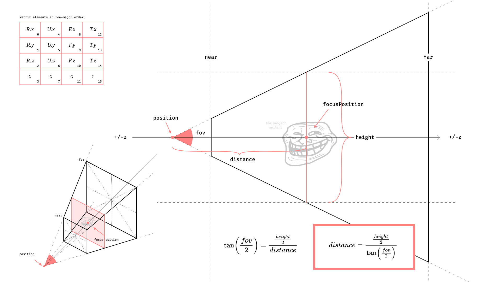

# Vertigo Camera

Vertigo is a new model of camera where the focus is primary on the subject of the camera.

Out the eye, let's enter the subject.

Key concepts:
- The subject is at the focus point.
- The camera has a "height" property that decides the size of the frame around the subject.
- The "fov" property is linearly translated to a 'perspective' one, where:
  - `1` is the human eye (about 50°).
  - `0` is the orthographic projection.
